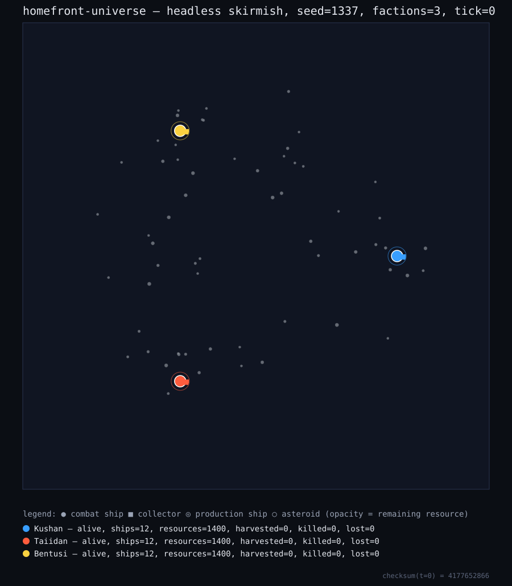
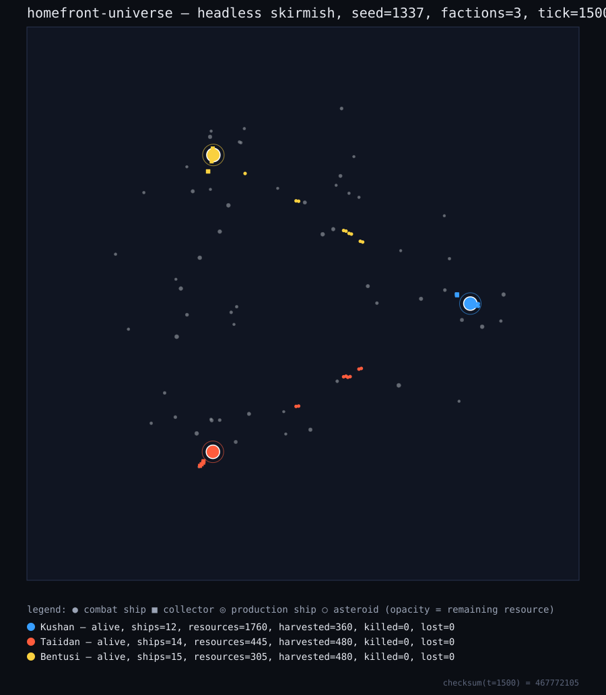
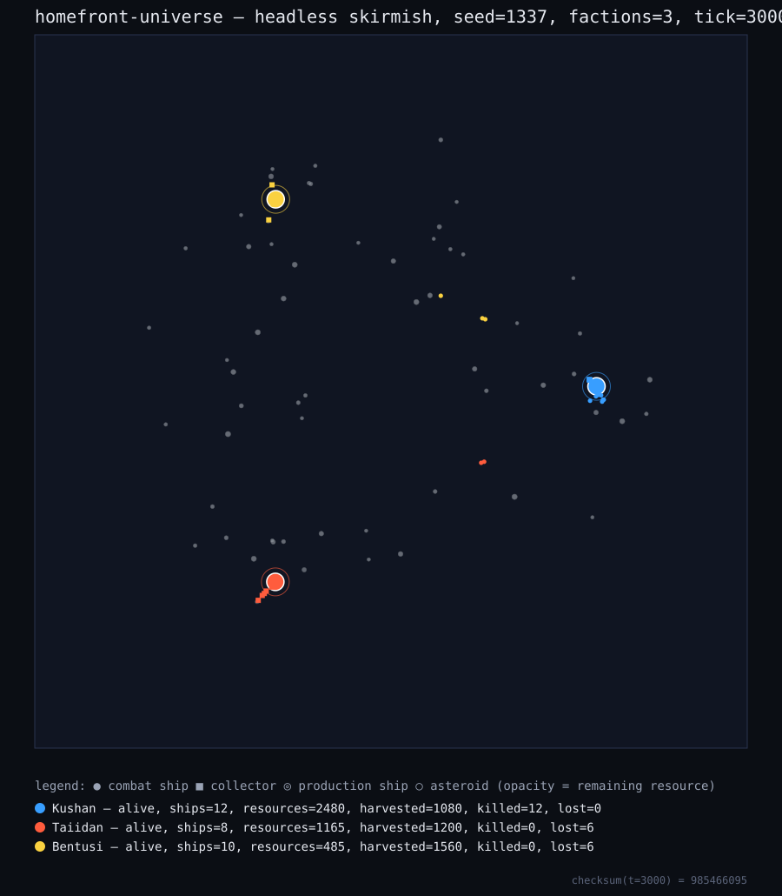

# HomeFront Universe

A deterministic, fixed-timestep fleet-combat simulation with an economy, squad AI, and a WebGL2 renderer. The repository implements its simulation, renderer, validation, test, bundle, and static-server tooling directly in JavaScript.

> **Evidence boundary:** `package.json` currently declares **0 runtime dependencies and 0 development dependencies**. That is a statement about npm package dependencies—not a claim that the project has no platform requirements. Running the tooling requires **Node.js >= 20**, and the interactive client requires browser APIs including WebGL2 and Canvas 2D.

## Quick start

```bash
git clone https://github.com/umutseve4/homefront-universe.git
cd homefront-universe
npm run verify
npm run serve
```

Then open `http://127.0.0.1:8080/dist/homefront.html`.

No dependency-install step is required for the checked-in scripts because both npm dependency maps are empty. `npm run verify` performs static validation, unit tests, bundling, and bundle checks; it also creates the untracked `dist/homefront.html` output.

For a renderer-free simulation run:

```bash
node tools/headless.mjs 1337 3 3000
```

## Verification surface

The repository exposes these reproducible checks:

| Command | Contract |
|---|---|
| `npm run validate` | Static module and GLSL-to-JavaScript contract validation |
| `npm test` | Node test suite for simulation, mesh, graphics, renderer, UI, and main helpers |
| `npm run bundle` | Build the self-contained `dist/homefront.html` artifact |
| `npm run checkbundle` | Structural and syntax checks for the emitted bundle |
| `npm run headless` | Renderer-free simulation with result table and checksum |
| `npm run verify` | `validate -> test -> bundle -> checkbundle` |

The CI workflow runs repository checks on pushes to `main`, pull requests targeting `main`, and manual dispatches. Its current matrix covers Node.js `20.x`, `22.x`, and `24.x`; CI results are evidence for the exact commit tested, not proof of browser rendering or production readiness.

### Recorded deterministic baseline

The checked-in workflow compares the Node.js `24.x` reference run

```bash
node tools/headless.mjs 1337 3 3000
```

against `checksum=985466095`. It also runs the same command twice on each matrix runtime and requires matching checksums within that runtime. This contract means **same seed + same tick count + same engine runtime => same checksum**; it does not claim bit-identical floating-point behavior across all CPUs or JavaScript engines.

## Visual state evidence

The SVG snapshots below are generated from simulation state by `tools/render_map_svg.mjs`. They are deterministic top-down state visualizations, not proof that the WebGL2 client rendered successfully in a browser.

```bash
node tools/render_map_svg.mjs
```

| t=0 — seeded start | t=1500 — economy running | t=3000 — battle state |
|---|---|---|
|  |  |  |

The t=3000 SVG embeds checksum `985466095`, matching the recorded headless baseline.

## Architecture

The codebase contains 18 ES modules arranged in four layers:

```text
src/core/    math.js, rng.js
src/sim/     defs.js, world.js, movement.js, combat.js, economy.js,
             ai.js, mapgen.js, game.js
src/gfx/     meshgen.js, camera.js, shaders.js, gl.js, renderer.js
src/ui/      input.js, hud.js
src/main.js  browser entry point and frame loop
```

Key design choices:

- fixed-timestep deterministic simulation;
- seeded PRNG as the simulation's randomness source;
- procedural meshes and starfield;
- WebGL2 instanced rendering plus Canvas 2D HUD;
- a repository-local text-transform bundler that emits one HTML file;
- a headless path for deterministic simulation checks without a renderer.

`docs/ARCHITECTURE.md` documents module boundaries, buffer contracts, rejected alternatives, and implementation constraints.

## Controls

| Input | Action |
|---|---|
| Left-drag | Box-select ships |
| Left-click | Select ship |
| Double-click | Select ships of the same type |
| Right-drag | Orbit camera |
| Middle-drag | Pan camera |
| Wheel | Zoom |
| Right-click on empty space | Move order |
| Right-click on enemy | Attack order |
| Right-click on asteroid | Harvest order |
| `1`-`9` | Queue a unit |
| `Space` | Pause or resume |
| `+` / `-` | Change simulation speed |

URL options are parsed by `readOptions()`: `?seed=1337&factions=3&speed=1&paused=1`.

## What automated checks do and do not prove

### Covered by repository checks

- simulation, economy, AI, mesh generation, camera math, renderer command generation, input helpers, and HUD logic under Node-based tests;
- static GLSL-to-JavaScript attribute-contract checks;
- emitted bundle structure and JavaScript syntax;
- repeatability of the headless checksum on the same tested runtime;
- package scripts executed through npm in CI.

### Not established by those checks

- successful shader compilation by a real GPU driver;
- successful execution of the browser `start()` frame loop;
- visual correctness in a real browser;
- accessibility, frame-rate, or cross-device behavior;
- networking, persistence, campaign gameplay, or production operations.

A real-browser/GPU acceptance pass remains the highest-value missing validation. Until that evidence exists, this repository should be presented as a deterministic prototype with automated Node-level verification—not as a production-ready game.

## Known limitations

- Single-threaded simulation and rendering.
- No networking, save/load, campaign, or audio.
- Behavioral rather than strategic AI.
- Avoidance-only collision handling.
- Single-pass post-processing.

## License

MIT — see [`LICENSE`](LICENSE). Copyright (c) 2026 Umut Sever.
