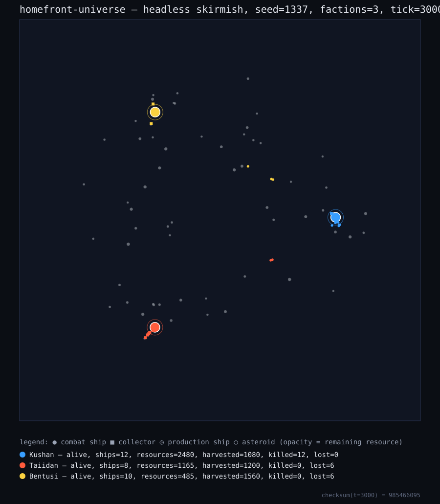
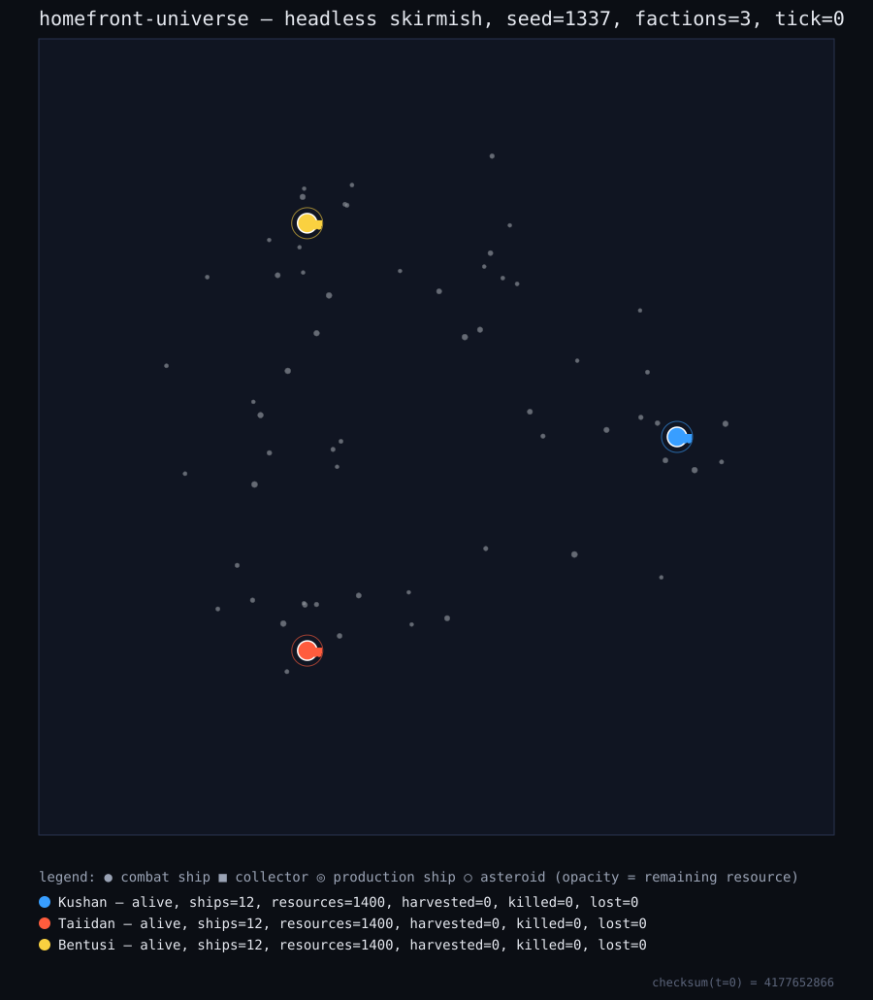
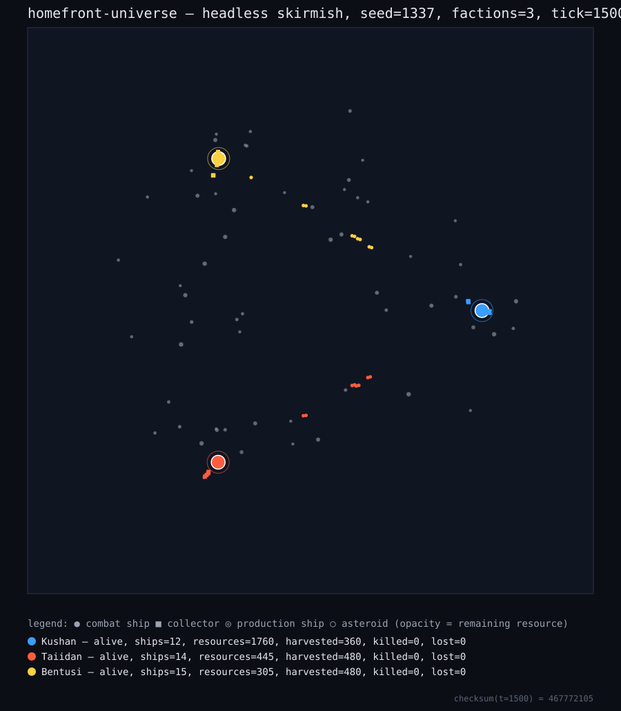

<h1 align="center">HomeFront Universe</h1>

<p align="center">
  A fleet-combat simulation that always produces the same battle from the same seed.<br>
  Economy, squad AI, and a WebGL2 renderer — and a checksum that proves<br>
  the fight replayed identically, tick for tick.
</p>

<p align="center">
  <a href="https://github.com/umutseve4/homefront-universe/actions"></a>
  
  
  
</p>

<p align="center">
  
</p>

---

## Run it in 60 seconds

```bash
git clone https://github.com/umutseve4/homefront-universe.git
cd homefront-universe
npm run verify
npm run serve
```

Open `http://127.0.0.1:8080/dist/homefront.html`.

No install step is needed — both npm dependency maps are empty. `npm run verify`
runs static validation, unit tests, bundling, and bundle checks, and produces the
untracked `dist/homefront.html`.

Renderer-free run:

```bash
node tools/headless.mjs 1337 3 3000
```

## The determinism contract

The workflow compares the Node.js `24.x` reference run of
`node tools/headless.mjs 1337 3 3000` against `checksum=985466095`, then runs the
same command **twice on every matrix runtime** and requires matching checksums
within that runtime.

> **same seed + same tick count + same engine runtime => same checksum.**
> This does *not* claim bit-identical floating-point behavior across all CPUs or
> JavaScript engines.

## Simulation state, visualized

Generated from simulation state by `node tools/render_map_svg.mjs`. These are
deterministic top-down state visualizations — not proof the WebGL2 client rendered
in a browser.

| t=0 — seeded start | t=1500 — economy running | t=3000 — battle state |
|---|---|---|
|  |  |  |

The t=3000 SVG embeds checksum `985466095`, matching the recorded headless baseline.

## Verification surface

| Command | Contract |
|---|---|
| `npm run validate` | Static module and GLSL-to-JavaScript contract validation |
| `npm test` | Node test suite for simulation, mesh, graphics, renderer, UI, and main helpers |
| `npm run bundle` | Build the self-contained `dist/homefront.html` artifact |
| `npm run checkbundle` | Structural and syntax checks for the emitted bundle |
| `npm run headless` | Renderer-free simulation with result table and checksum |
| `npm run verify` | `validate -> test -> bundle -> checkbundle` |

CI runs on pushes to `main`, pull requests targeting `main`, and manual dispatch,
across Node.js `20.x`, `22.x`, and `24.x`. CI results are evidence for the exact
commit tested — not proof of browser rendering or production readiness.

## Controls

| Input | Action |
|---|---|
| Left-drag | Box-select ships |
| Left-click | Select ship |
| Double-click | Select ships of the same type |
| Right-drag | Orbit camera |
| Middle-drag | Pan camera |
| Wheel | Zoom |
| Right-click on empty space | Move order |
| Right-click on enemy | Attack order |
| Right-click on asteroid | Harvest order |
| `1`-`9` | Queue a unit |
| `Space` | Pause or resume |
| `+` / `-` | Change simulation speed |

URL options are parsed by `readOptions()`: `?seed=1337&factions=3&speed=1&paused=1`.

<details>
<summary><b>Architecture — 18 modules in four layers</b></summary>

```text
src/core/    math.js, rng.js
src/sim/     defs.js, world.js, movement.js, combat.js, economy.js,
             ai.js, mapgen.js, game.js
src/gfx/     meshgen.js, camera.js, shaders.js, gl.js, renderer.js
src/ui/      input.js, hud.js
src/main.js  browser entry point and frame loop
```

Key design choices:

- fixed-timestep deterministic simulation;
- seeded PRNG as the simulation's randomness source;
- procedural meshes and starfield;
- WebGL2 instanced rendering plus Canvas 2D HUD;
- a repository-local text-transform bundler that emits one HTML file;
- a headless path for deterministic simulation checks without a renderer.

`docs/ARCHITECTURE.md` documents module boundaries, buffer contracts, rejected
alternatives, and implementation constraints.

</details>

## Limits

**Evidence boundary:** `package.json` declares **0 runtime and 0 development
dependencies**. That is a statement about npm packages — not about platform
requirements. The tooling needs **Node.js >= 20**; the interactive client needs
browser APIs including WebGL2 and Canvas 2D.

**Established by repository checks:** simulation, economy, AI, mesh generation,
camera math, renderer command generation, input helpers and HUD logic under Node
tests; static GLSL-to-JavaScript attribute contracts; emitted bundle structure and
syntax; headless checksum repeatability on the tested runtime.

**Not established:** shader compilation by a real GPU driver; execution of the
browser `start()` frame loop; visual correctness in a real browser; accessibility,
frame-rate, or cross-device behavior; networking, persistence, campaign gameplay,
or production operations.

Known limitations: single-threaded simulation and rendering; no networking,
save/load, campaign, or audio; behavioral rather than strategic AI; avoidance-only
collision handling; single-pass post-processing.

A real-browser/GPU acceptance pass remains the highest-value missing validation.
Until that evidence exists, this is a deterministic prototype with automated
Node-level verification — not a production-ready game.

---

MIT — see [`LICENSE`](LICENSE). Copyright (c) 2026 Umut Sever.
